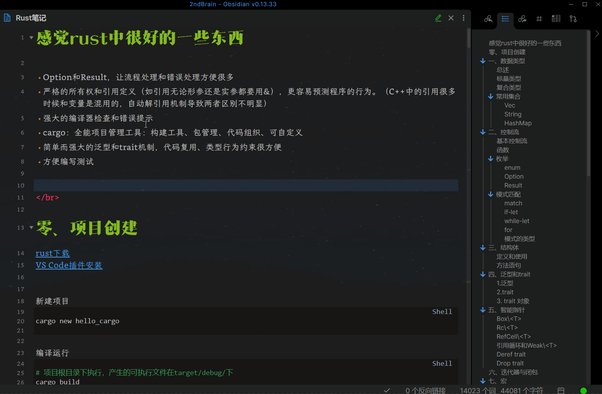
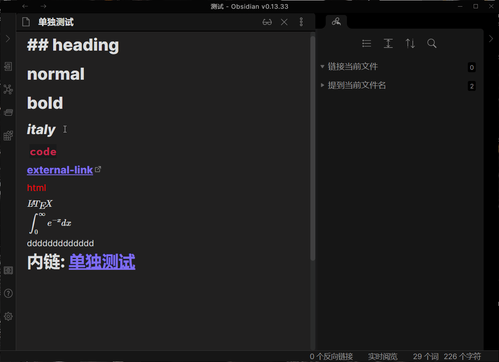

# Obsidian Quiet Outline

An outline plugin makes headings easier to read.

## Features

### No auto-expand when editing

Default Outline: 

Quiet Outline: 

### Search support

### Toggle light/dark mode

### Markdown render support

## Problems Now

+ [x] ~~Only support jumping in edit mode (no in preview mode).~~

## Limitations

+ Due to the lazy-rendering strategy of built-in editor (Only text showed in the current window is rendered. If scrolling too fast, you will see some text is not ready to be rendered and  the editor stutters), sometimes you can't jump to the place you want by one click **in edit mode**，especially when the note is opened for the first time since you open obsidian app.    Outline core plugin has the same issue.  Solution: **Just click again**.
+ If you use `1. xxxx` as a heading, you probably find something tricky. Because `<number>. xxx` is a markdown notation for a numbered list (`<ol>` element in HTML). Maybe try another notation instead, e.g., `1 . xxx`，`1- xxxx`, `1\. xxxxx`.

## Usage

Open command panel and input `Quiet Outline` ，then press `Enter` . 

For markdown-rendering, open `Markdown Render` option in setting panel.

## Install

+ Download the latest release. 

+ Extract and put the three files (`main.js`, `style.css`, `manifest.json`) to folder `{{obsidian_vault}}/.obsidian/plugins/obsidian-quiet-outline`.

